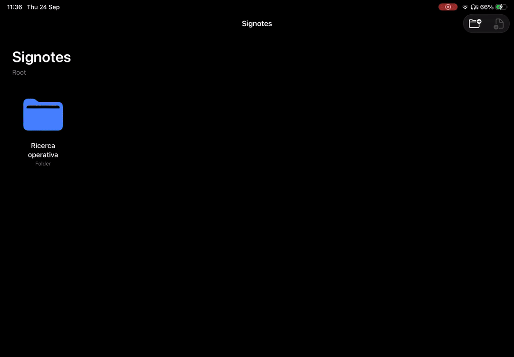

# Signotes

A local-first iPad note-taking app for Apple Pencil, built with SwiftUI and PencilKit. Write on real A4 pages with paper templates, a fountain pen and custom tools, and keep everything organized in folders — no account, no cloud.

<p align="center"></p>

## Features

- **Handwriting on A4 pages** with PencilKit, fixed page ratio, zoom, pan and fit-to-width.
- **Paper templates:** blank, ruled, grid and dotted, switchable per page.
- **Tools:** fountain pen, pen, pencil, highlighter, eraser and lasso, with undo/redo.
- **Custom tool presets:** create, rename and duplicate pens with your own color and width.
- **Library:** nested folders and notes in a grid, with colors, rename, delete and drag-and-drop to reorganize.
- **Page management:** page overview to add pages before/after, duplicate and delete them.
- **Autosave:** drawings and tool settings are saved automatically to local storage as you work.

## Tech stack

| Area | Choice |
| --- | --- |
| Language | Swift 6 (strict concurrency) |
| UI | SwiftUI, with a UIKit bridge for `PKCanvasView` |
| Drawing | PencilKit |
| Platform | iPadOS 18+ |
| Persistence | Local file system: JSON metadata + serialized `PKDrawing` per page |
| Tests | XCTest — 86 unit tests across domain, persistence and view models |

## Architecture

Signotes follows a modular Clean Architecture with MVVM in the presentation layer, so the drawing engine can be replaced later without touching library management or storage.

```
Signotes/
  App/            App entry point and dependency wiring
  Domain/         Pure models (folders, notes, pages, templates, tool presets) and repository protocols
  Data/           File-system repositories for the library and drawings
  Presentation/
    Library/      Folder/note grid, editing sheets, drag and drop
    Editor/       Note editor, tool palette, tool settings, page overview
    Canvas/       PencilKit bridge, A4 page container, zoom and page turning
SignotesTests/    Unit tests mirroring the layers above
```

On disk, the library is stored as `library.json` (folder, note and page metadata) plus one `drawings/<page-id>.drawing` file per page.

More detail: [docs/ARCHITECTURE.md](docs/ARCHITECTURE.md) · Product scope and roadmap: [docs/MVP.md](docs/MVP.md) · Milestone plans: [docs/exec-plans/](docs/exec-plans/)

## Getting started

Requirements: Xcode 16 or later, an iPad simulator or an iPad with iPadOS 18+. Apple Pencil is optional in the simulator.

1. Clone the repo and open `Signotes.xcodeproj`.
2. Select the **Signotes** scheme and an iPad simulator.
3. For a physical iPad, set your own signing team under *Signing & Capabilities*.
4. Run with **⌘R**. Run the tests with **⌘U**.

## Roadmap

- PDF import and export
- iCloud sync
- Handwriting search (OCR)
- Apple Pencil Pro enhancements (squeeze, barrel roll)
- A custom Metal stroke renderer for a more realistic fountain pen

## Credits

Tool icon designs credit Icons8 — see [docs/third-party-attributions.md](docs/third-party-attributions.md).

## License

[MIT](LICENSE) © 2026 Diego Signorastri
